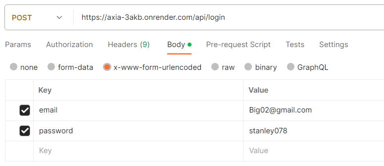
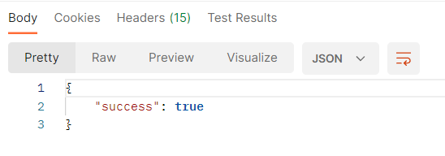

# API EndPoints

---

**GET** /api/all
This endpoint gets all info in the database, I mean everything in the axia database.

**POST** /api/signup
This endpoint is responsible for signups into the axia database. it also validates input data and returns results to the frontend for display. Below is Snippet of the request and response in postman App.

_Request:_

_Respose:_

**POST**/api/login
This endpoint is responsible for login into the axia database. it also validates user input and returns results to the frontend for display. Below is Snippet of the request and response in postman App.

_Request:_

_Response:_

**DELETE** /api/delete
This endpoint is responsible for deleting accounts from axia database. it also validates user before deletion.

**PUT** /api/investment
This endpoint is responsible for subscription of investment packages. The investment _package_ and _duration_ are parsed to the backend as query params.
example:
http://xx.com/investment/?package=Auto_Trading_&duration=1
